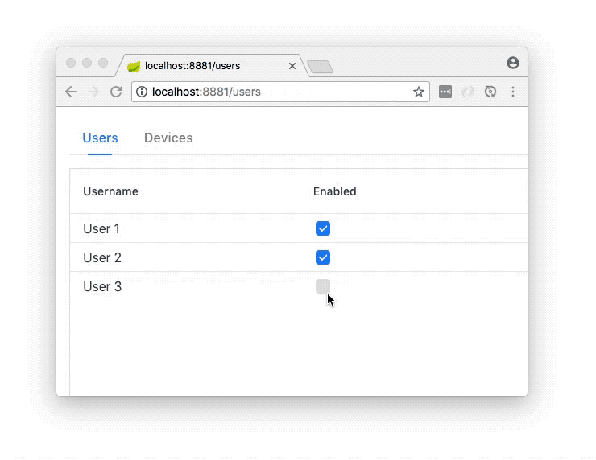

= Component Renderer Issue

This repo is for the purposes of documenting a potential bug with Vaadin 10 Flow Component Renderers
when used with the Grid and RouterLayout.

The project has 2 grids with a Tab based RouterLayout used to navigate between them.

When the page is visited directly using the full route, for example:

http://localhost:8881/users

Then the component renderer's correctly render CheckBox in the "Enabled" column.

It you navigate to the second grid, but using the `Devices` tab, you can see that
the Checkbox on that second grid, do not appear.

Only when the browser window is refreshed do they appear.

If I navigate bacl to the `Users` tab, the same issue occurs, and a browser refresh fixes it.

The GIF below, shows the issue:

Thanks.

